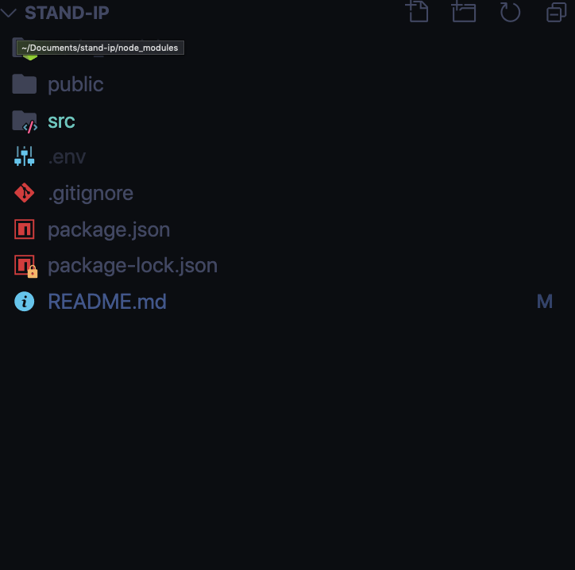
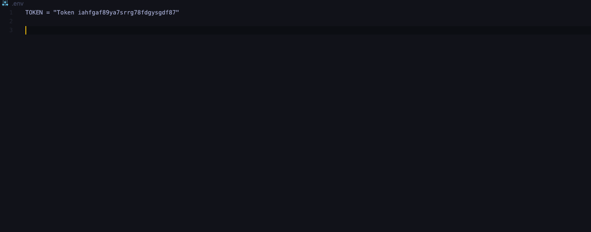

# Stand Up
Stand Up is an application meant to solve the issues with a stand-up meeting with larger groups. I have also a Motivation utilizting us of the PaperQuotes Api.

## Tech/framework used
#### Built With
- Create React App
- axios

#### Installation
Since I have used https://api.paperquotes.com/apiv1/quotes/?lang=en. You will have to go to http://paperquotes.com/ and sign up for a free account.

The following steps will help you get an Api Key from  http://paperquotes.com/. 
1. Go To http://paperquotes.com/
2. Create A Free Account
3. After you have signed up for an account at paperquotes.com, you should be welcomed to a dashboard.
4. Click on the button "Api Key" , which should located on right side of the dashboard.
5. Boom !! You should be able to see your Api Key now !!

The following steps will help clone the repo! 
1. Go To https://github.com/hectorohernz/Stand-up
2. Towards the upper right side of the window, click on the green button that says "Code".
3. You will now want to either Download Zip, or if you have git installed you will like to run the following command in your Terminal on macOS, which should be the same on Windows Too. 
`git clone https://github.com/hectorohernz/Stand-up.git`;
4. Now Just wait until it is finished downloading.
5. After you have download the appm you will want to download all the npm devdependencies.
Congrats !!!

The following steps will help add the Apikey!
1. In the root of the project, you will want to create a file called `.env`
	
2. After creating the .env file, you will want to add the following code inside of it, but replace `Your Api Key Goes Here` with the Api Key that was provided to.
`TOKEN = "Your Api Key Goes Here"`
    
3. You should be set! 

Now you should able to run the the project, with the following command.
`npm run start`;

